# React Native Captions Clone with Convex, ElevenLabs, Sentry and Expo

This is a React Native Captions clone using [Convex](https://convex.link/simongrimm) for real-time data synchronization, [ElevenLabs](https://try.elevenlabs.io/j7ztnqelnoqj) for text-to-speech, [Clerk](https://go.clerk.com/GiiEcN5) for user authentication and [Sentry](https://dub.sh/sentry-galaxies) for error tracking.

Additional features:

- [Expo Router](https://docs.expo.dev/routing/introduction/) file-based navigation
- [Convex Database](https://docs.convex.dev/database?utm_source=simon_grimm&utm_medium=video&dub_id=eV96rPl11O0EC58S) for data storage
- [Convex File Storage](https://docs.convex.dev/file-storage?utm_source=simon_grimm&utm_medium=video&dub_id=eV96rPl11O0EC58S) for file storage
- [Sentry](https://dub.sh/sentry-galaxies) for error tracking
- [Clerk Passkeys](https://docs.clerk.com/passkeys/overview?utm_source=simong&utm_medium=youtube&utm_campaign=captions-clone&dub_id=5zB4z5fxgHWQzbgE) for passwordless authentication
- [Haptics](https://docs.expo.dev/versions/latest/sdk/haptics/) for haptic feedback
- [Jotai](https://jotai.pmnd.rs/) for state management
- [NativeWind](https://www.nativewind.dev/) for styling
- [Expo Linear Gradient](https://docs.expo.dev/versions/latest/sdk/linear-gradient/) for gradient backgrounds
- [Expo Secure Store](https://docs.expo.dev/versions/latest/sdk/secure-store/) for secure storage
- [Expo Image Picker](https://docs.expo.dev/versions/latest/sdk/image-picker/) for image picking
- [Expo Video](https://docs.expo.dev/versions/latest/sdk/video/) for video playback
- [Expo Audio](https://docs.expo.dev/versions/latest/sdk/audio/) for audio playback

### 🎥 Follow the video tutorial

Watch and build this Captions clone step by step:

TODO: Add video
<p align="center">
  <a href="https://youtu.be/A8gJFybTPr0?si=MbVOcnPJEfRWCOmi" target="_blank">
    <!--  -->
  </a>
</p>


## Setup


### Environment Setup

Make sure you have the [Expo CLI](https://docs.expo.dev/get-started/set-up-your-environment/) installed.

For the best development experience, you should have [Android Studio](https://developer.android.com/studio) and [Xcode](https://developer.apple.com/xcode/) (Mac only) installed. For more information on setting up your development environment, refer to the [Expo documentation](https://docs.expo.dev/workflow/android-studio-emulator/) for Android Studio and the [React Native documentation](https://reactnative.dev/docs/environment-setup?guide=native) for Xcode.

### App Setup

To build the app, follow these steps:

1. Clone the repository
2. Run `npm install`
3. Run `npx expo prebuild`
4. Run `npx expo run:ios` or `npx expo run:android`

### Convex Setup

1. Create an account on [Convex](https://convex.link/simongrimm)
2. Run `bunx convex dev` to start the development server

### Microservice Setup

To export the video with burned in captions we need an environment with `ffmpeg` installed (you can do this locally).

1. Go into the `/microservice` folder
2. Run `npm install` to install the dependencies
3. Run `npm run dev` to start the microservice

You then have to add the URL to the Convex environment variable `MICROSERVICE_URL`. I recommend using something like [ngrok](https://ngrok.com/) to test the microservice locally.

`npx convex env set MICROSERVICE_URL <your-microservice-url>/transcode`

## Clerk Setup

Make sure to add your `EXPO_PUBLIC_CLERK_PUBLISHABLE_KEY` to the `.env` file.

### Authentication Setup

Create a [Clerk](https://clerk.com/) account and project, then update the `convex/auth.config.js` file with your `domain` and `applicationID`.

```js
export default {
  providers: [
    {
      domain: 'https://your-clerk-domain.clerk.accounts.dev',
      applicationID: 'your-clerk-application-id',
    },
  ],
};
```

You also need to connect Convex and Clerk with a JWT template. For this, cehck out the video and [Convex docs](https://docs.convex.dev/auth/clerk?utm_source=simon_grimm&utm_medium=video&dub_id=eV96rPl11O0EC58S).

### Webhook Setup

You need to set up a webhook in Clerk to handle the user creation and update events.

1. Go to [Clerk](https://clerk.com/?utm_source=simong&utm_medium=youtube&utm_campaign=captions-clone&dub_id=5zB4z5fxgHWQzbgE) and select your project
2. Go to **API** and select **Webhooks**
3. Add the following webhook, which should point to your Convex instance and include the `user.created` and `user.deleted` events:


### ElevenLabs Setup

1. Create an account on [ElevenLabs](https://try.elevenlabs.io/j7ztnqelnoqj)
2. Get an API key from ElevenLabs
3. Add the key to Convex by running `bunx convex env set ELEVENLABS_API_KEY=<your-api-key>`


### Sentry Setup

1. Create a new project on [Sentry](https://dub.sh/sentry-galaxies)
2. Use the `npx @sentry/wizard@latest -s -i reactNative` command to setup Sentry for your project


## App Screenshots

<div style="display: flex; flex-direction: 'row';">
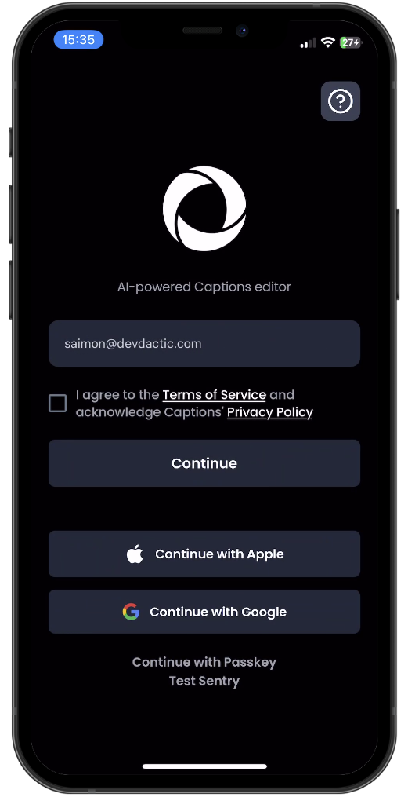
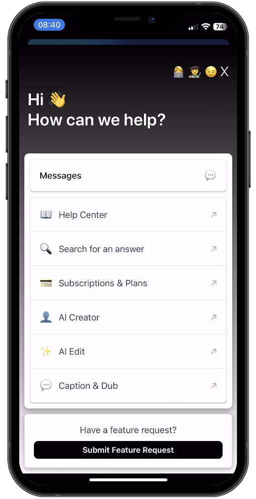
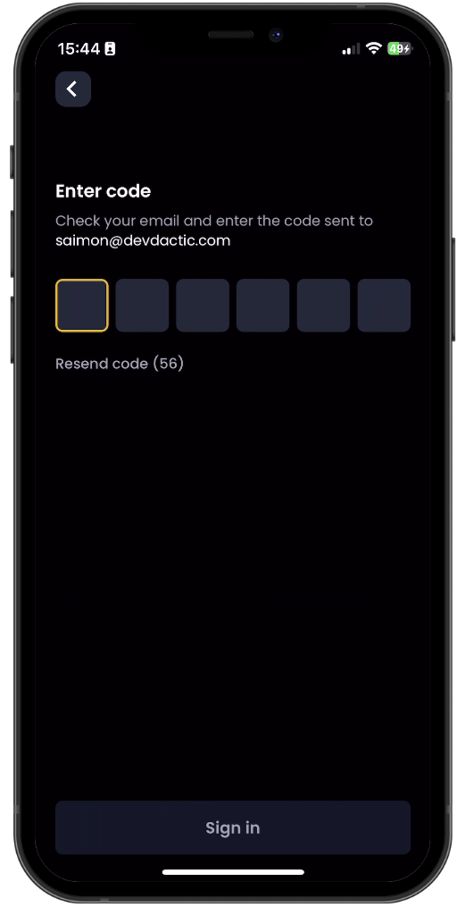
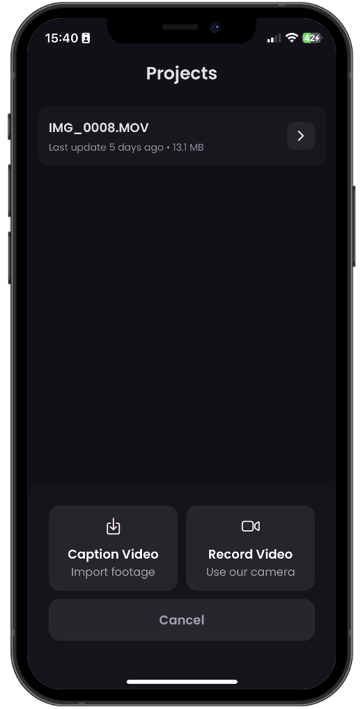
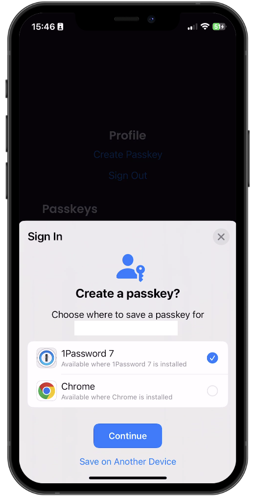

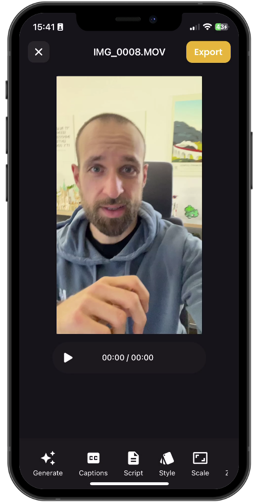
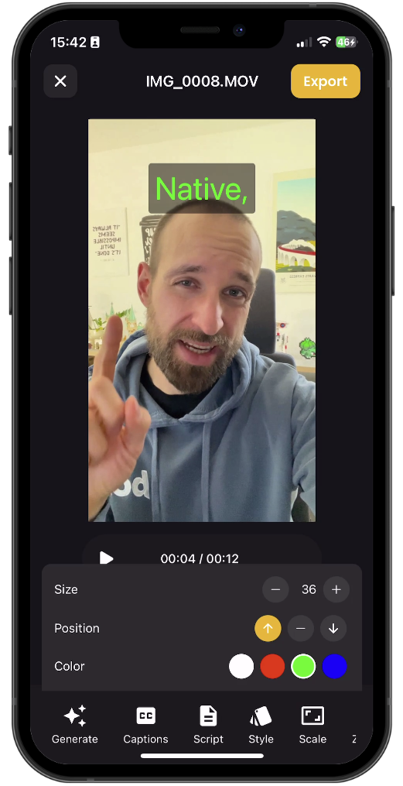
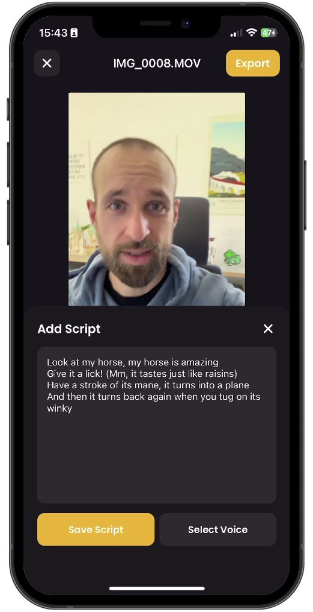
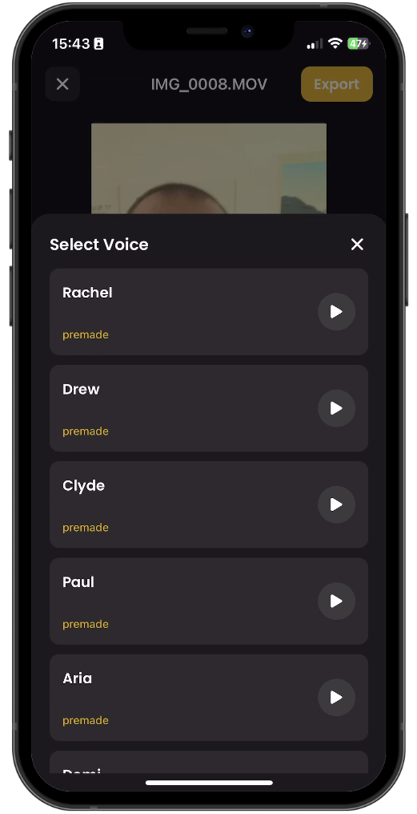
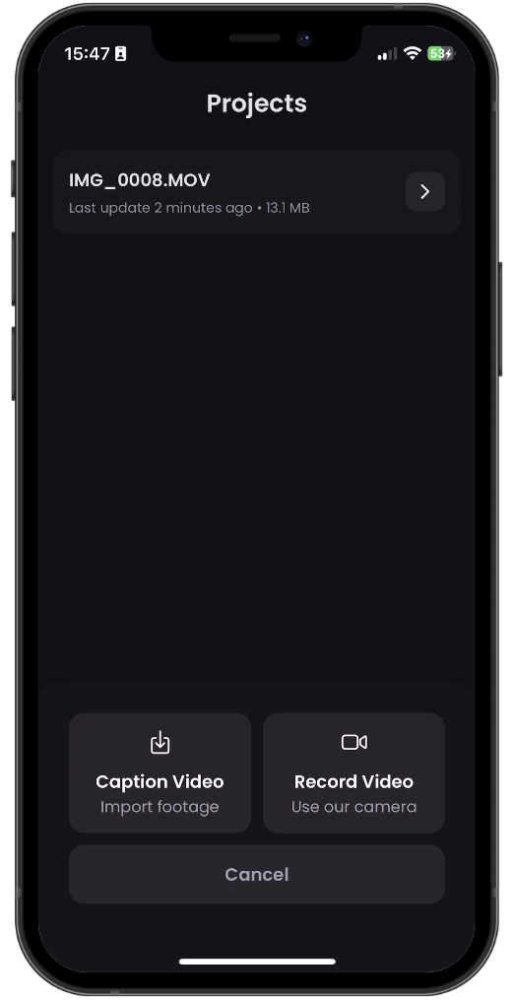


</div>

## Demo

<div style="display: flex; flex-direction: 'row';">

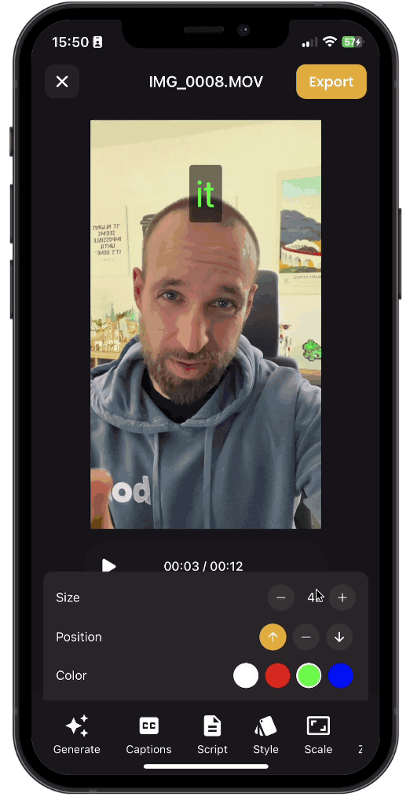


</div>

## Sentry Screenshots

<div style="display: flex; flex-direction: 'row';">


</div>

## Convex Screenshots

<div style="display: flex; flex-direction: 'row';">


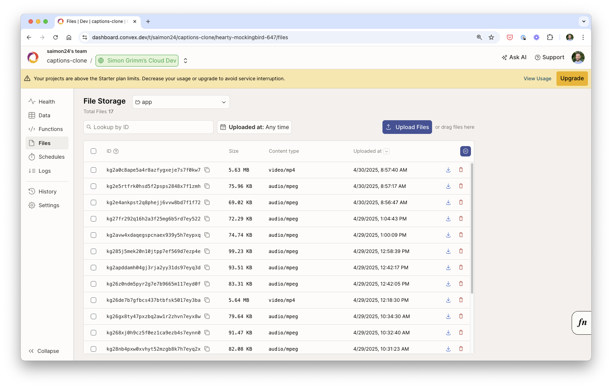

</div>

## 🚀 More

**Take a shortcut from web developer to mobile development fluency with guided learning**
Enjoyed this project? Learn to use React Native to build production-ready, native mobile apps for both iOS and Android based on your existing web development skills.

<a href="https://galaxies.dev?utm_source=simongrimm&utm_medium=github&vid=captions-clone"></a>